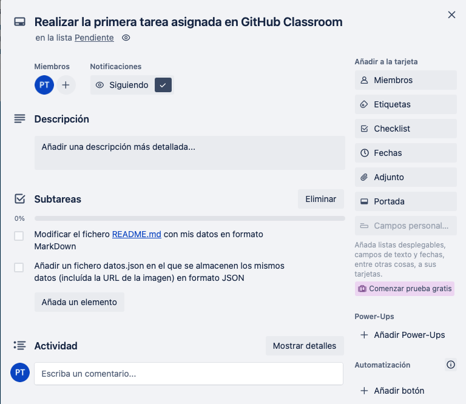

# Práctica 1 Desarrollo Ágil

### Pedro Torrús Castillo

Estudiante de Ingeniería Informática en la Universidad de Jaén
* **Correo**: ptc00006@red.ujaen.es
* **GitHub**: https://github.com/Pedrotc02
* **Tabla Trello**: https://trello.com/b/PzAs1QMG/práctica1

### Capturas de pantalla de Trello al inicio de la práctica

### Capturas de pantalla de mi GitHub
